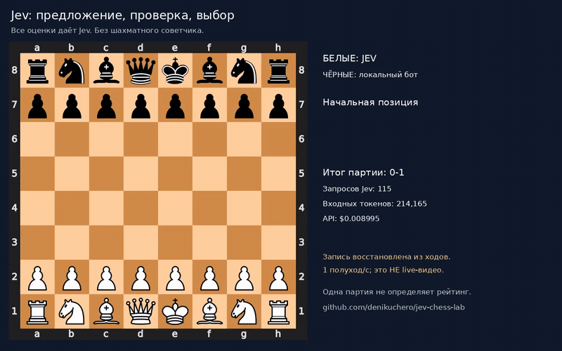
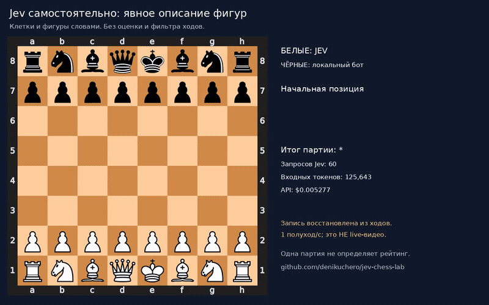
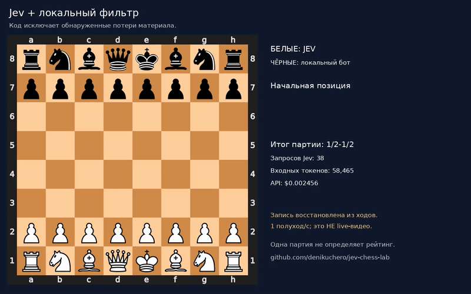
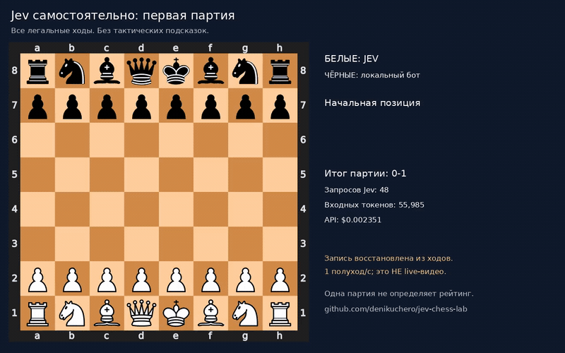

# Jev Chess Lab

Six recorded chess experiments with TypeSafe Jev via OpenRouter: independent play,
a tactical filter, Stockfish assistance, and a return to Jev-only play.

**The Stockfish-assisted system won. Independent Jev still blunders pieces.
Assisted results are not evidence that Jev became a strong chess player.**

**[Watch all games](https://denikuchero.github.io/jev-chess-lab/)** ·
[Research notes (Русский)](docs/RESEARCH_RU.md) · [Usage (Русский)](docs/USAGE_RU.md)

## Watch directly on GitHub

Full-game looping GIFs, one ply per second. These are rendered replays, **not real-time recordings**.
Click a GIF to open the interactive board with step-by-step controls.

### 06 — Jev proposes, reviews three moves, then chooses (new)

No chess advisor. Jev changed its first choice on 16/23 turns, but still lost
by checkmate. 115 API calls, $0.008995; no reliable strength gain established.

[](https://denikuchero.github.io/jev-chess-lab/games/06-jev-review-loop/replay.html)

### 05 — Jev alone: explicit piece descriptions

Stopped at the 60-call budget, **unfinished**, not a draw. Jev still blundered
pieces and repeatedly moved its rook between d1 and e1. This prompt experiment
did not establish a playing-strength improvement.

[](https://denikuchero.github.io/jev-chess-lab/games/05-pure-explicit-pieces/replay.html)

### 02 — Jev with a tactical filter (assisted)

This version discarded some blunders in code; it does not represent unaided Jev.

[](https://denikuchero.github.io/jev-chess-lab/games/02-guarded/replay.html)

### 01 — Jev alone: original prompt

[](https://denikuchero.github.io/jev-chess-lab/games/01-raw/replay.html)

### 04 — Jev alone: longer instructions and full history

[](https://denikuchero.github.io/jev-chess-lab/games/04-pure-history/replay.html)

### 03 — Jev with Stockfish (engine-assisted, not independent play)

[](https://denikuchero.github.io/jev-chess-lab/games/03-stockfish-assisted/replay.html)

## Results

Recorded September 18, 2026. Jev plays White. Costs are reported by OpenRouter;
local compute is excluded. One game per configuration; no Elo estimate or training.

| Experiment | White's decision process | Opponent | Result | API calls | Input / output tokens | API cost |
|---|---|---|---|---:|---:|---:|
| [01: Raw](docs/games/01-raw/game.pgn) | Jev, all legal moves | Local depth-2 bot | Lost, 48…Qc3# | 48 | 55,985 / 10,120 | $0.00235137 |
| [02: Guarded](docs/games/02-guarded/game.pgn) | Jev after exchange filtering | Same bot, seed 42 | Draw by repetition | 38 | 58,465 / 8,390 | $0.00245553 |
| [03: Stockfish-assisted](docs/games/03-stockfish-assisted/game.pgn) | Jev chooses from Stockfish shortlist | Stockfish 14.1, Skill 5 | Won, 38.Rd8# | 38 | 63,194 / 1,522 | $0.002654148 |
| [04: Pure + history](docs/games/04-pure-history/game.pgn) | Jev, expanded prompt + SAN history | Same local bot, seed 42 | Lost, 17…Qxd1# | 17 | 21,875 / 4,690 | $0.00091875 |
| [05: Explicit pieces](docs/games/05-pure-explicit-pieces/game.pgn) | Jev, square-to-piece map + descriptive moves | Same local bot, seed 42 | Unfinished at limit, material deficit | 60 | 125,643 / 13,170 | $0.005277006 |
| [06: Jev review loop](docs/games/06-jev-review-loop/game.pgn) | Jev proposes, critiques and selects | Same local bot, seed 42 | Lost, 23…Qd1# | 115 | 214,165 / 32,060 | $0.00899493 |

Every game folder includes an interactive HTML board, MP4, PGN and actual JSON
requests/responses, positions, latency and usage. Provider request IDs were removed.

## Videos

**Rendered from saved moves at one ply per second; not screen recordings or
real-time demonstrations.** Measured decision latency is shown separately. No audio.

- [01 — independent Jev](docs/games/01-raw/replay.mp4)
- [02 — tactical filter](docs/games/02-guarded/replay.mp4)
- [03 — Stockfish assistance](docs/games/03-stockfish-assisted/replay.mp4)
- [04 — independent Jev with history](docs/games/04-pure-history/replay.mp4)
- [05 — independent Jev with explicit piece descriptions](docs/games/05-pure-explicit-pieces/replay.mp4)
- [06 — Jev proposal-review-selection loop](docs/games/06-jev-review-loop/replay.mp4)

## Run Jev independently

Python 3.10+. Set your own `OPENROUTER_API_KEY` in `.env` or the environment.
Live games make paid API calls; published replays do not.

```bash
python3 -m venv .venv
.venv/bin/pip install -r requirements-chess.txt
cp .env.example .env
# Edit .env and add your key.
.venv/bin/python chess_demo.py --max-turns 60
```

Default: `--policy raw --opponent simple`. Jev receives FEN, a coordinate board,
complete UCI/SAN histories and **all legal moves in fixed UCI order**. No move scores,
tactical filtering, Stockfish hints, corrections or fallback moves for White.
The local bot searches only for Black; its scores are never passed to Jev.
`python-chess` enforces legality and game termination.

The current raw prompt is `pure-v3-explicit-pieces` (experiment 05). It adds an
explicit square-to-piece dictionary and descriptive move labels. These are
observations, not tactical scores; every legal move remains available.
The change is experimental and has not established a strength improvement. The original prompt
is preserved in experiment 01's trace; rerunning current code is not a byte-for-byte
reproduction of that prompt. API outputs can vary.

```bash
# Inspect a request without API access.
.venv/bin/python chess_demo.py --dry-run

# Jev still plays independently; Stockfish is only its opponent.
.venv/bin/python chess_demo.py --policy raw --opponent stockfish --skill 5 --engine-path /path/to/stockfish
```

Results go to `results/chess-.../replay.html`. Default limit: 60 Jev calls; reaching
it means unfinished (`*`), not a draw. Available repetition/50-move draw claims
are automatically accepted for either side. API errors stop the game.

## Experimental Jev-only review loop

```bash
.venv/bin/python chess_demo.py --policy deliberate --max-turns 40 --max-api-calls 200
```

Jev proposes all moves through a choice distribution. Its top three candidates
are reviewed by three parallel Jev calls: material-loss risk, mate risk, quality,
and a hypothetical Black reply. A final Jev call selects the move. If all three
are rejected at risk ≥0.65, up to three more are reviewed within the budget.
Usually 5 calls per White turn, at most 8. The threshold is experimental.

No engine scores or programmatic tactical filter are used. Code only enumerates
legal moves and constructs hypothetical boards. Every ranking and risk estimate
comes from Jev. These are correlated judgments from the same model, not independent
evidence of correctness. Full stage-by-stage traces and costs are retained.
`--dry-run` shows only the proposal request; later requests depend on API answers.

## Archived assisted modes

```bash
.venv/bin/python chess_demo.py --policy guarded
.venv/bin/python chess_demo.py --policy engine --opponent stockfish --skill 5 --engine-path /path/to/stockfish
```

`guarded` estimates immediate captures and same-square exchanges. It can miss
combinations and reject good sacrifices. It is not a safety guarantee.

`engine` analyses up to five Stockfish candidates, keeping moves within 40
centipawns of the best estimate and preferring non-repetition when winning.
In experiment 03, **18/38 turns offered only one move**; the other 20 offered
multiple engine-approved moves. Stockfish supplies the main chess strength.
We did not demonstrate any improvement over Stockfish alone.

That run used Stockfish 14.1: White's coach at Skill 20 / 100,000 nodes, Black
at Skill 5 / 15,000 nodes, one thread and 64 MiB hash each. Unequal budgets,
not a fair engine match. `--seed` controls the local bot, not Stockfish randomness.
No Stockfish binary is bundled. Install it separately; see the
[official project](https://stockfishchess.org/) and
[strength-setting FAQ](https://official-stockfish.github.io/docs/stockfish-wiki/Stockfish-FAQ.html).

## Other Decisions API experiments

24 examples: support routing, factual support, relevance ranking, rules and intent.

```bash
python3 jev.py --list
python3 jev.py --dry-run --limit 1
python3 jev.py --input examples/custom.json
```

[Saved results](docs/decisions/results.json): 27/27 labelled answers matched.
This tiny curated set does not establish general accuracy or calibration.
Synthetic `--demo` answers are not model evaluations.

## Validation and video reproduction

```bash
.venv/bin/python -m unittest discover -s tests -v
```

26 chess/API tests passed locally. Default-mode tests reject calls to tactical filters or
Stockfish. Recorded games were checked for legality, final results and PGN/JSON
agreement. Optional real-Stockfish tests skip if the executable is unavailable.

Install FFmpeg, Cairo, DejaVu Sans and the media requirements to render videos.
The exporter uses local original results, or published traces in a fresh clone:

```bash
.venv/bin/pip install -r requirements-media.txt
.venv/bin/python scripts/publish_artifacts.py
.venv/bin/python scripts/render_gifs.py
```

## Limitations and attribution

One game per variant; different prompts, assistance and opponents; no repeated-seed
study. This is exploratory research, not a controlled benchmark. Error counts from
our own filter are not independent strength measurements. Choice probabilities
are not winning probabilities. API calls do not train Jev's weights.

Built with [python-chess](https://python-chess.readthedocs.io/),
[TypeSafe Jev](https://docs.typesafe.ai/api),
[OpenRouter](https://openrouter.ai/typesafe/jev-1.13) and optional Stockfish.
Media uses CairoSVG, Pillow and FFmpeg.
[GPL-3.0-or-later](LICENSE) · [Third-party notices](NOTICE).
